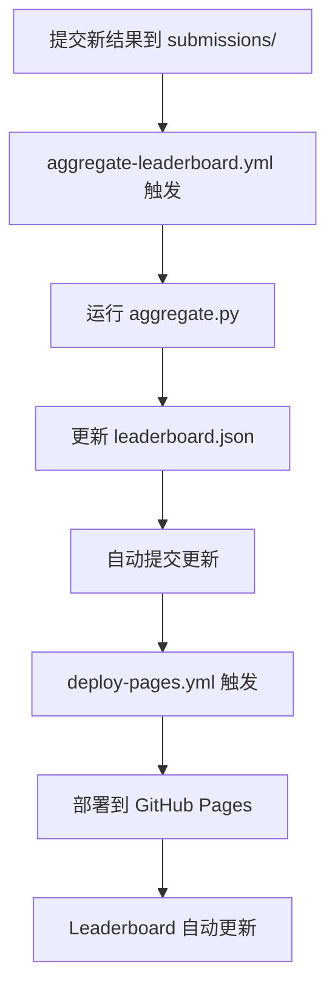

# GitHub Pages 配置检查清单

## ✅ 已完成的配置

### 1. Workflow 文件 (GitHub Actions)

- ✅ `.github/workflows/aggregate-leaderboard.yml` - 自动聚合提交的结果
- ✅ `.github/workflows/deploy-pages.yml` - 自动部署到 GitHub Pages

### 2. Leaderboard 文件

- ✅ `leaderboard/index.html` - Leaderboard 网页
- ✅ `leaderboard/leaderboard.json` - 数据文件
- ✅ `leaderboard/aggregate.py` - 数据聚合脚本
- ✅ `leaderboard/submissions/` - 提交目录
- ✅ 静态资源文件 (logo.png, SVG icons)

### 3. 文档

- ✅ `leaderboard/README.md` - 使用说明
- ✅ `leaderboard/DEPLOYMENT.md` - 部署指南

## 🚀 GitHub 上需要的配置

请按照以下步骤在 GitHub 仓库设置中完成配置：

### 步骤1: 启用 GitHub Pages

1. 进入仓库的 **Settings** (设置)
2. 点击左侧菜单的 **Pages**
3. 在 **Build and deployment** 区域:
   - **Source**: 选择 `GitHub Actions`
   - ⚠️ 不要选择 "Deploy from a branch"
4. 保存

### 步骤2: 配置 Actions 权限

1. 在 **Settings** 中点击 **Actions** → **General**
2. 滚动到 **Workflow permissions**
3. 选择 `Read and write permissions` ✅
4. 勾选 `Allow GitHub Actions to create and approve pull requests` ✅
5. 点击 **Save**

### 步骤3: 推送代码

```bash
git add .
git commit -m "feat: setup GitHub Pages and workflows"
git push origin main
```

### 步骤4: 验证部署

1. 进入 **Actions** 标签页
2. 等待 "Deploy GitHub Pages" workflow 完成
3. 访问你的 Pages URL (在 Settings → Pages 中显示)

## 📍 预期的 URL

部署成功后，你的 leaderboard 将在以下地址可访问：

```
https://hly1998.github.io/ChronoPlay/
```

## 🔧 本地测试

在推送到 GitHub 之前，你可以本地测试：

```bash
cd leaderboard
python -m http.server 8000
```

然后访问 `http://localhost:8000/`

## 📝 提交新的评估结果

用户可以通过以下方式提交：

### 方式1: Pull Request (推荐)

1. Fork 你的仓库
2. 在 `leaderboard/submissions/` 添加结果 JSON 文件
3. 提交 Pull Request
4. 合并后自动更新 leaderboard

### 方式2: 直接提交到 main (需要权限)

```bash
cp my_results.json leaderboard/submissions/
git add leaderboard/submissions/my_results.json
git commit -m "feat: add my system results"
git push
```

## 🔄 自动化流程



## ⚠️ 常见问题

### Q: Actions 没有运行？
A: 检查 Actions 权限是否正确配置（步骤2）

### Q: Pages 显示 404？
A: 
- 确认 Pages source 设置为 "GitHub Actions"
- 等待几分钟让部署完成
- 检查 Actions 日志是否有错误

### Q: leaderboard.json 没有更新？
A:
- 检查提交的 JSON 格式是否正确
- 查看 aggregate-leaderboard.yml 的运行日志
- 验证文件是否在 `leaderboard/submissions/` 目录下

## 📚 相关文档

- [leaderboard/README.md](../leaderboard/README.md) - 用户提交指南
- [leaderboard/DEPLOYMENT.md](../leaderboard/DEPLOYMENT.md) - 详细部署文档
- [GitHub Pages 官方文档](https://docs.github.com/en/pages)
- [GitHub Actions 官方文档](https://docs.github.com/en/actions)

## ✨ 完成后

配置完成后，你的 leaderboard 将会：

- ✅ 自动接受新的提交
- ✅ 自动聚合和验证数据
- ✅ 自动部署更新到网站
- ✅ 实时显示最新排名

享受你的自动化 leaderboard！🎉

